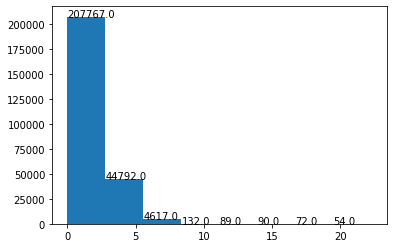
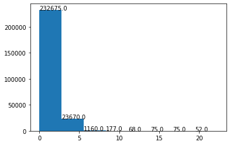

# Progress Report 10/10/2021

Since I joined the lab, the majority of my work has been own the following 3 aspects:

1. CT and MRI dataset search. Mainly 3D and 4D dataset that focus on Lung
2. Image registration on a 4D lung CT to reconstruction voxel motions during a respiratory phase. Reconstruct a mesh from segmentation of lung and apply the registration result to it so Fei's simulator can model the deformation. (This is a part of the lung biopsy automation project)
3. Deep learning based Lung motion estimation. Similar to registration, the task aim to predict deformation vector fields for breathing lung. (I work on this under direct supervision of Shan Lin)

#### Dataset Search:

For dataset search, we are interested in datasets that 

1. represent mutiple organs and have contour labels on each organ
2. Contains time series representing how an organ moves overtime under a force. 
3. Datasets that have groundtruth landmarks. Landmarks show positions of key points overtime(e.g. position of a vessel during a lung respiratory phase)

Current datasets that I'm using for both image registration and DL lung motion estimation:

1. 4D lung: https://wiki.cancerimagingarchive.net/display/Public/4D-Lung (4D, large, contours)
2. Popi Model: https://www.creatis.insa-lyon.fr/rio/popi-model (4D, contours, landmarks)
3. DIR lab: https://www.dir-lab.com/ (4D, contours, landmarks)
4. SPARE Challenge: https://image-x.sydney.edu.au/spare-challenge/ (4D, large, real world noise)

I also investigated automatic segmentation method for different organs in case contours are not provided.

1. Lung: https://github.com/JoHof/lungmask

2. Liver: https://github.com/andreped/livermask

#### Image Registration Method:

For image registration, I started with using a traditional demon-based regsitration method and compared that with two deep learning based algorithm. 

Demon registration: https://github.com/InsightSoftwareConsortium/SimpleITK-Notebooks

Gdl fire(supervised): https://github.com/IPMI-ICNS-UKE/gdl-fire-4d

Voxelmorph(unsupervised): https://www.kaggle.com/kmader/voxelmorph-on-ct-data

Given a 4D CT data with segmentation labels of each organ of interests, I use CT image at  and  to perform a registration. The output of such registration is then a transform i%2B1}"> (a matrix of 3d vectors). By applying i%2B1}"> back to , we are able to obtain a predicted CT image 

 is shown on the left of the video(demons),  on the right:

https://github.com/Lancial/ArclabReport/blob/master/10.10.2021/Screen%20Recording%202021-09-22%20at%209.22.23%20AM.mov

Note: The left image gets blury overtime. I think this is an expected error accumulation from applying registrations

GDL-fire:

https://github.com/Lancial/ArclabReport/blob/master/10.10.2021/Screen%20Recording%202021-10-10%20at%202.56.19%20PM.mov

Voxelmorph:

##### Numerical evaluation:

Metric used:

Jaccard

dice

Volume Similarity

False_negative

False_positive

Hausdorff Distance:

Surface distance(mean, median, max, std)

Result from comparing  and  ,  is used as a ground truth reference. The reason I picked them is that the movement is large and the labels are relatively good.

##### Analysis for Demon based method:

Jaccard, dice, volume similarity, false positive are improved

###### Surface distance:

We can see that mean, median, std of the surface distance are all improved by the registration. Here are the distribution of surface distance.

Before registration

After registration

From the histogram above, we know that outlier with very large error exists.  Here are two reasons: 

Grayscale images on top shows the surface distance

Ground truth are labeled in purple, green contours on the left are from gt from , those on the left are predicted contours obtained by applying 2} ... I_{3->4}"> in a row to .

1. The label from the dataset that i'm using is not perfect. This is likely causing the largest error

2. Error of registration(large at the boundary)

##### Future plan:

1. I have given my result to Fei. So the plan is to wait for his feedback.
2. Based on Fei's feedback I will debug or find better Image registration framework (NiftyReg, AntsReg)

#### DL lung motion estimation

This project is still at the beginning phase, so far I have done:

1. literature review of SOTA organ motion estimation method and other works of related domain such as optical flow prediction, non-regid body reconstruction

2. dataset loading, preprocessing, and augmentation using pytorch and torchio

3. a vanilla network design including modules of Convolutional encoder, Spatial transformer, Convolutional Lstm, spatial pyramid

##### Future plan:

1. first reduce the problem to a 2d problem: predict motion in 2d medical images. Finish the traning pipeline. Train and evaluate the result. Verify our idea.
2. then fix and Modify the network, enable it to handle 3d data. Develop methods to tackle the memory consumption problem.

 
